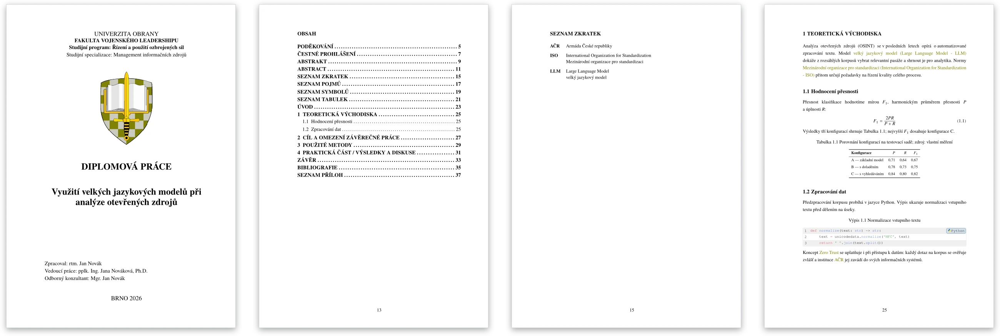
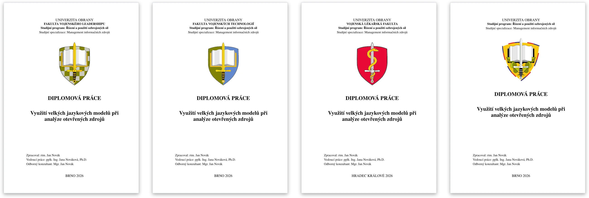
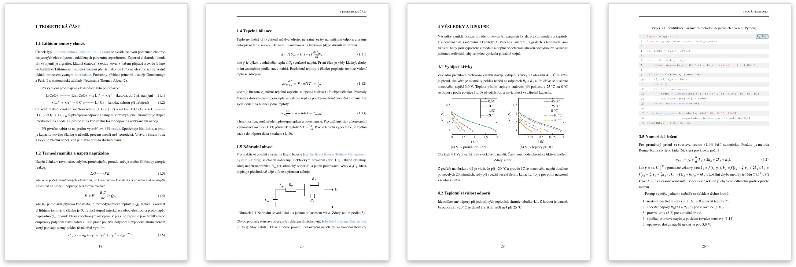

<div align="center">

# UNOB Thesis Template

**Official template for bachelor's, master's, and doctoral theses at the University of Defence, written in&nbsp;[Typst](https://typst.app/).**<br>
All faculties · Czech and English · PDF/A and PDF/UA · typesets in under a second

[](https://github.com/iamanro/uo-thesis/actions/workflows/ci.yml) [](CHANGELOG.md) [](https://typst.app/) [](LICENSE)

[Česky](README.md) · **English**



[Quick start](#quick-start) · [Writing your thesis](#writing-your-thesis) · [Reference](#reference) · [Development](#development) · [License](#license) · [Cheat sheet: Typst vs. Word (Czech, PDF)](docs/tahak.pdf)

</div>

---

## Features

- 🏛️ **Every faculty and degree** — `fvl`, `fvt`, `vlf`, `uo`, plus variants with the University of Defence logo; bachelor's, master's, and doctoral theses.
- 🌍 **Czech and English** — title page, headings, and lists translate themselves; the declaration is always Czech, with the supervisor's name declined into the genitive.
- ⚙️ **One `config.toml`** — all metadata and switches in one place; a typo in a key is reported immediately.
- 📚 **Glossary, symbols, citations** — `#trm` for acronyms and terms with Czech grammatical cases, a list of symbols with units, ČSN ISO 690.
- ✅ **Pre-submission check** — `submit_check` rejects sample text, a missing abstract or assignment, images without `alt`, and leftover `#todo`s.
- ♿ **Archival and accessible PDF** — PDF/A-3b with one compiler flag; PDF/UA-1 needs `alt` text on every image and equation (see [accessibility](#reference)).
- ✍️ **Draft mode** — wide margin for notes, `#todo` / `#note` visible only in drafts, faster typesetting.
- ⚡ **Fast and lean** — the sample thesis typesets in ~0.25 s; the only dependencies are `vlna` and `codly`.

<div align="center">

<br><sub>Title pages for <code>fvl</code>, <code>fvt</code>, <code>vlf</code>, and <code>uo</code> — logo, faculty name, and city are set automatically.</sub>
</div>

## Example thesis

A complete fictitious master's thesis of 40 pages (19 pages of text) lives in [`examples/diplomka/`](examples/diplomka/); the finished PDF is attached to the [latest release](https://github.com/iamanro/uo-thesis/releases/latest) as `ukazka-diplomka.pdf`. It shows the whole template in action: mathematics and numbered equations, chemical formulas and reactions, physics operators, numbers with units and uncertainties, graphs and diagrams drawn directly in Typst, subfigures, tables, code listings in three languages, a glossary with symbols, citations, appendices, a landscape page, and `submit_check`. The text is in Czech.



| Area | Package |
|---|---|
| Chemistry | [`typsium`](https://typst.app/universe/package/typsium) |
| Physics (derivatives, operators) | [`physica`](https://typst.app/universe/package/physica) |
| Numbers, units, uncertainties | [`zero`](https://typst.app/universe/package/zero) |
| Graphs and drawings | [`cetz`](https://typst.app/universe/package/cetz) + [`cetz-plot`](https://typst.app/universe/package/cetz-plot) |
| Diagrams | [`fletcher`](https://typst.app/universe/package/fletcher) |
| Subfigures | [`subpar`](https://typst.app/universe/package/subpar) |

```bash
typst compile --root . --font-path template/fonts examples/diplomka/main.typ
```

## Quick start

> [!NOTE]
> Until the template is on [Typst Universe](https://typst.app/universe/), install it as a **local package**: the whole repository (the folder with `typst.toml`) goes into Typst's local package folder.

**1. Install the template** (Linux):

```bash
git clone https://github.com/iamanro/uo-thesis.git ~/.local/share/typst/packages/local/unob-thesis/0.1.0
```

<details>
<summary>macOS, Windows, and installing without Git</summary>

| System | Package folder |
|---|---|
| Linux | `~/.local/share/typst/packages/local/unob-thesis/0.1.0/` |
| macOS | `~/Library/Application Support/typst/packages/local/unob-thesis/0.1.0/` |
| Windows | `%APPDATA%\typst\packages\local\unob-thesis\0.1.0\` |

Without Git: download `unob-thesis-<version>.tar.gz` from the [latest release](https://github.com/iamanro/uo-thesis/releases/latest) (tested in CI, verify it with `SHA256SUMS`) and extract it into the package folder from the table:

```bash
mkdir -p ~/.local/share/typst/packages/local/unob-thesis/0.1.0
tar -xzf unob-thesis-0.1.0.tar.gz -C ~/.local/share/typst/packages/local/unob-thesis/0.1.0
```

</details>

**2. Create your project** — this makes a `my-thesis` folder with `main.typ`, `config.toml`, chapters, and fonts:

```bash
typst init @local/unob-thesis:0.1.0 my-thesis
```

Without the Typst command line, copy the contents of the `template/` folder into a new folder.

**3. Write and typeset** — pick an editor:

<details open>
<summary><b>VS Code + Tinymist</b> (local, recommended)</summary>

1. Install [VS Code](https://code.visualstudio.com/) and the **Tinymist Typst** extension from the Marketplace.
2. Open the project folder (`File ▸ Open Folder…`).
3. Set `tinymist.fontPaths` to `fonts` to use the bundled fonts (or install them system-wide — see Fonts under [Reference](#reference)).
4. Open `main.typ` and click **Preview** in the top-right — Typst typesets live as you write.
5. Export the PDF with **Typst: Export to PDF** (`Ctrl/Cmd+Shift+P`), or from the command line with `typst compile --font-path fonts main.typ`.

</details>

<details>
<summary><b>Typst web app</b> (in the browser, no install)</summary>

The web app cannot see local packages (`@local/…`), so you upload the template source as well:

1. At [typst.app](https://typst.app/) create an **Empty project**.
2. From the repository, drag the **contents of the `template/` folder** (including `fonts/`) and the **`src/` folder** next to it.
3. In `main.typ` replace `"@local/unob-thesis:0.1.0"` with `"src/lib.typ"`, and in the files in `chapters/` with `"../src/lib.typ"`.
4. Open `main.typ`; download the PDF with **Download PDF**.

</details>

> [!TIP]
> Once the template is on Typst Universe, you can create a project with a single command, `typst init @preview/unob-thesis` — no install needed.

## Writing your thesis

Thesis metadata go into **`config.toml`**, the text into separate files:

```toml
lang    = "cs"
faculty = "fvl"        # fvl | fvt | vlf | uo; with the UO logo: uo-fvl | uo-fvt | uo-vlf

[thesis]
type  = "master"       # bachelor | master | doctoral
title = "Thesis title"

[author]
name    = "Jan"
surname = "Novák"
sex     = "M"          # M | F — gendered Czech forms (Zpracoval/Zpracovala…)

[supervisor]
name    = "Jana"
surname = "Nováková"
sex     = "F"

[keywords]
czech   = "první, druhé, třetí"
english = "first, second, third"
```

**`main.typ`** is a fixed skeleton — normally you only add an `#include` for each new chapter:

```typ
#import "@local/unob-thesis:0.1.0": *

#let glossary = toml("glossary.toml")

#show: unob-thesis.with(
  ..thesis-config(toml("config.toml")),
  acronyms: glossary, terms: glossary, symbols: glossary,
  bibliography: bibliography("references.bib", style: "iso-690-numeric", full: true),
  acknowledgement: include "front/acknowledgement.typ",
  abstract: (
    czech: include "front/abstract-cs.typ",
    english: include "front/abstract-en.typ",
  ),
  introduction: include "chapters/00-introduction.typ",
  appendix: [#include "appendix.typ"],
  // Exceptional overrides go here AFTER the spread — they win over config.toml.
)

#include "chapters/01-theory.typ"

#conclusion[#include "chapters/99-conclusion.typ"]
```

| What | Where |
|---|---|
| Metadata and switches (faculty, type, title, people, keywords) | `config.toml` — every key is commented |
| Chapter text (`=` chapter, `==` / `===` sections) | `chapters/*.typ` |
| Abstracts and acknowledgement | `front/*.typ` |
| Acronyms, terms, and symbols — in text `#trm("iso")` | `glossary.toml` |
| References — cite with `@key` | `references.bib` |
| Appendices | `appendix.typ` |

```
my-thesis/
├── config.toml       thesis metadata and switches
├── main.typ          skeleton: config, frontmatter, chapter includes
├── glossary.toml     acronyms, terms, symbols
├── references.bib    sources
├── front/            abstract-cs.typ, abstract-en.typ, acknowledgement.typ
├── chapters/         00-introduction.typ, 01-theory.typ, …, 99-conclusion.typ
├── appendix.typ      appendices
└── fonts/            TeX Gyre (Termes, Termes Math, Cursor)
```

In chapter files import helpers **from the package** (`#import "@local/unob-thesis:0.1.0": trm, flex-caption`), not from `src/…`. Add a new chapter with an `#include` line in `main.typ` before `#conclusion[…]`.

> [!IMPORTANT]
> Before submission set **`submit_check = true`** in `config.toml` and keep `draft = false`. The template rejects sample content, a missing abstract, introduction, assignment, or keywords, images without `alt` text, and leftover `#todo`s.

## Reference

<details>
<summary><b>Template parameters</b></summary>

Metadata are read from `config.toml` via `thesis-config()`. Every parameter can also be given directly in `unob-thesis.with(...)` — a value after the spread wins. Content parameters (`abstract`, `introduction`, `bibliography`, `appendix`, …) always go in `main.typ`.

| Parameter | Type / values | Default | Description |
|---|---|---|---|
| `lang` | `"cs"` \| `"en"` | `"cs"` | Document language |
| `draft` | bool | `false` | Draft mode (see Draft and final below) |
| `faculty` | `"fvl"` \| `"fvt"` \| `"vlf"` \| `"uo"` \| `"uo-fvl"` \| `"uo-fvt"` \| `"uo-vlf"` | `"uo"` | Faculty; `uo-*` variants = faculty with the University of Defence logo |
| `programme` | content / string | `[]` | Study programme |
| `specialisation` | content / string | `[]` | Specialisation (typeset as "Field of Study" for doctoral theses) |
| `thesis` | `(type, title)` | — | `type`: `"bachelor"` \| `"master"` \| `"doctoral"` |
| `author` | `person(...)` | — | Thesis author |
| `supervisor` | `person(...)` | — | Supervisor |
| `first_advisor` | `person(...)` | empty | Advisor |
| `second_advisor` | `person(...)` | empty | Co-supervisor (doctoral only) |
| `assignment_front` | `none` \| `false` \| content | `none` | Assignment front — scan or export (png/jpg/pdf), e.g. `image("zadani-lic.pdf", alt: "Thesis assignment")`; `none` = placeholder, `false` = no page |
| `assignment_back` | `none` \| `false` \| content | `none` | Assignment back |
| `acknowledgement` | `false` \| content | `false` | Acknowledgement |
| `declaration` | bool | `true` | Declaration of authorship |
| `ai_used` | bool | `false` | AI-usage paragraph in the declaration |
| `abstract` | `(czech, english)` | empty | Abstracts |
| `keywords` | `(czech, english)` | empty | Keywords (comma-separated strings) |
| `introduction` | content | `[]` | Introduction |
| `acronyms` / `terms` / `symbols` | `false` \| `true` \| dictionary | `false` | Glossary (see Glossary below); all three must pass the same glossary |
| `outlines` | dictionary | see below | Generated lists |
| `theme` | dictionary | see below | Colours |
| `bibliography` | `none` \| `bibliography(...)` \| array | `none` | Bibliography |
| `appendix` | `none` \| content | `none` | Appendices |
| `submit_check` | bool | `false` | Strict pre-submission check |
| `vlna` | bool \| `auto` | `auto` | Czech non-breaking spaces; `auto` = on in final, off in draft |
| `fancy_heading` | bool | `false` | Running header with the chapter title |
| `twoside` | bool | `true` | Double-sided print (chapters on odd pages, blank pages); `false` = electronic version |

- `outlines` (bool): `headings`, `acronyms`, `terms`, `symbols`, `figures`, `tables`, `equations`, `listings`.
- `theme`: `color` (master switch), `links_colored`, `faculty_colored`, `faculty_color` (custom hex or `none`), `link_color`.
- `person(prefix, name, surname, suffix, sex, genitive)`: `sex` is `"M"`, `"F"`, or `none` (masculine forms); `genitive` is a manual Czech genitive of the full name for the declaration.

</details>

<details>
<summary><b>Public API</b></summary>

The package (`src/lib.typ`) exports:

| Function | Purpose |
|---|---|
| `unob-thesis` | Main template for `#show` |
| `thesis-config(...)` | Turns `toml("config.toml")` into template parameters (wraps people in `person`, reports key typos) |
| `person(...)` | Author, supervisor, advisors |
| `conclusion[...]` | Thesis conclusion (localized unnumbered heading + content) |
| `trm("key", style:, case:, display:)` | Acronym or term from the glossary |
| `singular`, `plural`, `first`, `first-plural` | Styles for `trm` |
| `flex-caption(long, short)` | Long caption under the figure, short one in lists |
| `todo[...]`, `note[...]` | Notes visible only in drafts (`todo` blocks `submit_check`) |
| `landscape[...]` | Rotates a wide table/figure by 90° on a portrait page; the content must fit on one page |
| `appendix[...]` | Low-level appendix mode (the `appendix` parameter is usually enough) |
| `vlna-on()`, `vlna-off()`, `vlna-debug-on()`, `vlna-debug-off()` | Toggle non-breaking spaces for part of the text |

</details>

<details>
<summary><b>Glossary</b></summary>

Acronyms, terms, and symbols live in one `glossary.toml`, one TOML table per entry:

```toml
[iso]
short = "ISO"
en = "International Organization for Standardization"
cs = "Mezinárodní organizace pro standardizaci"

[zero_trust]
short = "Zero Trust"
cs = "nulová důvěra"
glossary = "A security model that implicitly trusts no element of the network."

[rho]
symbol = "rho"
symbol_alt = "rho, density"
unit = "kg m^(-3)"
unit_alt = "kilogram per cubic metre"
cs = "hustota"
```

- An entry **without** `glossary` is an **acronym** (LIST OF ACRONYMS); `short` may contain a space (`MO ČR`).
- An entry **with** `glossary` is a **term** (LIST OF TERMS with its definition).
- An entry with `symbol` is a **symbol** (LIST OF SYMBOLS, typeset as math); `unit` is its unit.
- Fields: `short`, `en` and `cs` (expansions), optionally `plural`, `longplural` (English plural), `csplural` (Czech plural). For PDF/UA add `symbol_alt` and `unit_alt` to symbols — the template does not invent descriptions.

In text: `#trm("iso")` always prints the short form. Keys match exactly first, then case-insensitively, then by `short`; an unknown key reports similar entries. Introduce an acronym on first use with `#trm("iso", style: first)`; plural with `style: plural`, Czech case with `case: 1–7` (acronyms only), your own declined form with `display: [normy ISO]`. The lists print every entry in `glossary.toml`, used in the text or not.

Pass `acronyms: toml("glossary.toml")` so your edits take effect; `acronyms: true` loads only the package's demo glossary.

</details>

<details>
<summary><b>Bibliography</b></summary>

Native Typst `bibliography(...)`. The built-in `iso-690-numeric` style matches ČSN ISO 690:

```typ
bibliography: bibliography("references.bib", style: "iso-690-numeric", full: true)
```

Several lists with their own titles (or a custom CSL):

```typ
bibliography: (
  bibliography("books.bib", style: "iso-690-numeric", full: true, title: [Books]),
  bibliography("online.bib", style: "iso-690-numeric", full: true, title: [Online sources]),
)
```

Disable with `bibliography: none`.

</details>

<details>
<summary><b>Declension of the supervisor's name</b></summary>

The declaration is always in Czech and the supervisor's name is declined into the genitive automatically. If the heuristic gets it wrong, set the form manually — in `config.toml` as `genitive = "Jana Kadlece"`, or inline:

```typ
supervisor: person(name: "Jan", surname: "Kadlec", sex: "M", genitive: "Jana Kadlece")
```

</details>

<details>
<summary><b>Draft and final, lists, appendices</b></summary>

**Draft and final.** `draft: true` is for writing: no title page or frontmatter, a wide right margin for notes, visible `#todo` / `#note`, faster typesetting. **Final** is the submitted version with the title page, declaration, and lists. Page numbers are printed from the table of contents on, but counted from the title page so odd numbers stay on recto pages.

**Generated lists.** Lists of figures, tables, equations, and listings render only when the document has matching items; the lists of acronyms, terms, and symbols when the glossary has matching entries — even with `outlines.*: true`.

**Appendices.** Pass them as content: `appendix: [#include "appendix.typ"]`. Each appendix (`= Title`) starts on a new page; pages and figures are numbered `A–1`, equations `(A–1)`. Appendix figures stay out of the lists of figures and tables. Without an H1 heading the LIST OF APPENDICES is skipped; the main table of contents lists only the LIST OF APPENDICES, individual appendices appear in the PDF bookmarks.

</details>

<details>
<summary><b>Fonts</b></summary>

The template uses the **TeX Gyre** family, bundled in the project's `fonts/` folder (`template/fonts/` in the repository): `TeX Gyre Termes` (text), `TeX Gyre Termes Math` (math), `TeX Gyre Cursor` (code).

The web app loads fonts from the project automatically. Locally pass `--font-path fonts`, or install the fonts system-wide. The full family is on [CTAN](https://mirrors.ctan.org/fonts/tex-gyre.zip).

</details>

<details>
<summary><b>Look and typography (<code>src/config.toml</code>)</b></summary>

Every tunable typesetting value lives in [`src/config.toml`](src/config.toml): heading sizes, fonts, leading, indentation, margins, tables, the title page, and faculty colours. Lengths are strings with a unit (`"12pt"`, `"0.7em"`, `"35mm"`, `"47%"`):

```toml
[heading]
h1_size = "16pt"
```

The `[faculty]` section holds the official faculty colours — do not change them without the University of Defence's consent (see [`NOTICE`](NOTICE)).

</details>

<details>
<summary><b>Additional packages</b></summary>

The template deliberately exports no boxes, callouts, or drawing tools. If you need more, import Typst Universe packages directly in your thesis. Tested with the template (see the [example thesis](#example-thesis)): `@preview/typsium` (chemistry), `@preview/physica` (physics), `@preview/zero` (units), `@preview/cetz` and `@preview/cetz-plot` (graphs), `@preview/fletcher` (diagrams), `@preview/subpar` (subfigures). More options: `@preview/showybox`, `@preview/frame-it`.

> [!WARNING]
> **Do not import `@preview/vlna`.** The template already handles Czech non-breaking spaces (`@preview/vlna:0.4.0` in `src/styling/packages.typ`). A second `#show: apply-vlna` applies every rule twice — same output, much slower compile (544-page dissertation: 7.9 s → 11.2 s). For part of the text use `#vlna-off()` / `#vlna-on()`.

</details>

<details>
<summary><b>Good practice and accessibility</b></summary>

- **Supervisor wants Word:** the typeset PDF can be converted with Adobe Acrobat (*File › Export a PDF › Microsoft Word*) or Adobe's online PDF-to-Word tool. Use the result for reading and comments, not for further writing: fields, numbering, and cross-references are not live, and equations and tables may break. Keep writing in Typst and convert again.
- Replace all sample content (text, references, glossary, metadata) with your own and turn on `submit_check` before submitting.
- **Accessibility (PDF/UA):** give every image an `alt` text, especially the assignment scan: `assignment_front: image("zadani.png", alt: "Thesis assignment")`. The template sets the document language, metadata, and logo `alt` texts; Typst exports tagged PDF.
- **Archival PDF:** `typst compile --pdf-standard a-3b main.typ`. Verify conformance with [veraPDF](https://verapdf.org/); a successful export does not replace a screen-reader check.
- **PDF/UA-1 and mathematics:** `--pdf-standard ua-1` requires `alt` text on every image **and every equation**, including inline `$R_0$`. A thesis with a lot of mathematics therefore can hardly be exported as PDF/UA-1; the example thesis is exported as PDF/A-3b only. Without equations and with described images the template itself passes.
- **Electronic vs. printed:** for the electronic PDF turn off blank pages with `twoside = false`; the printed version stays `twoside = true`.
- Prefer vector graphics (`.svg`) and shrink large images before submitting.

</details>

## Development

```bash
python3 -m unittest discover -s tests -v       # regression tests (Typst + Poppler)
python3 scripts/ci.py check --output dist      # same as CI: package, typst init, 9 PDFs + the example thesis
```

Want to contribute? Setup, code map, and guidelines are in [`CONTRIBUTING.md`](.github/CONTRIBUTING.md); report bugs and ideas via [Issues](https://github.com/iamanro/uo-thesis/issues/new/choose).

<details>
<summary><b>Tests and previewing changes</b></summary>

The tests compile real PDFs in temporary folders through the public interface: the glossary (resolution, collisions, unknown entries, links with and without lists), `submit_check`, and the supervisor's genitive. They need Python 3, Typst, and `pdftotext` (Poppler); `TYPST` selects a specific compiler binary.

To preview template changes by hand, link the repository as a local package (Linux) and typeset the sample project:

```bash
mkdir -p ~/.local/share/typst/packages/local/unob-thesis
ln -sfn "$PWD" ~/.local/share/typst/packages/local/unob-thesis/0.1.0
typst watch --font-path template/fonts template/main.typ
```

For large theses try `--jobs 8` instead of the automatic thread count (fewer threads were faster on a 32-thread machine). Use `draft: true` while writing; turning off vlna changes typography and is not a lossless optimization.

</details>

<details>
<summary><b>CI/CD and releases</b></summary>

The **Typst CI** workflow (`.github/workflows/ci.yml`) runs on pull requests, `main`, and manual dispatch: Ubuntu 24.04, the Typst version from `package.compiler` in `typst.toml` with a verified SHA-256, bundled fonts only, commit-pinned actions, read-only permissions. It runs the tests, **installs the template from the built archive with `typst init @local/…`**, and typesets seven profiles (CS/EN, final/draft, all seven faculty variants, single- and double-sided, running header) plus PDF/A-3b and PDF/UA-1. Compiler warnings are errors. The `typst-dist` artifact (PDFs, `unob-thesis-<version>.tar.gz`, `build-info.json`, `SHA256SUMS`) is kept for 14 days.

Locally (Python 3.12+, Git, Poppler; the installer targets Linux x86_64):

```bash
bash scripts/install-typst.sh /tmp/unob-typst
TYPST=/tmp/unob-typst/typst python3 scripts/ci.py check --output dist
(cd dist && sha256sum --check --strict SHA256SUMS)
```

The output folder must be empty; the archive contains only tracked files (`git add` new ones). When the compiler version changes, update the checksum in `scripts/install-typst.sh`.

**Releases:** after changing `package.version` and the template imports, push the tag `v<package.version>`. The **Typst release** workflow reruns the full check and only then creates a GitHub Release with the tested artifacts; it rejects other tags and never overwrites an existing release. The scoped `GITHUB_TOKEN` is enough; nothing is published to Typst Universe automatically.

</details>

## License

| Part | License |
|---|---|
| Package code (`src/`, repository tooling) | [AGPL-3.0-or-later](LICENSE) |
| Starter project (`template/` without fonts) — the files `typst init` copies into your thesis | [MIT-0](LICENSE-MIT-0): use, modify, and share without restriction or attribution |
| TeX Gyre fonts (`template/fonts/`) | GUST Font License |
| University of Defence logos (`src/assets/logo*.svg`) | UO's own terms, see [`NOTICE`](NOTICE) |

The faculty and university logos are the intellectual property of the University of Defence and are **not** covered by the AGPL or MIT-0 — they may be used only in a genuine University of Defence thesis and must not be modified (see [`NOTICE`](NOTICE)). Make sure your use of the logos follows the rules of the University of Defence and your faculty.
